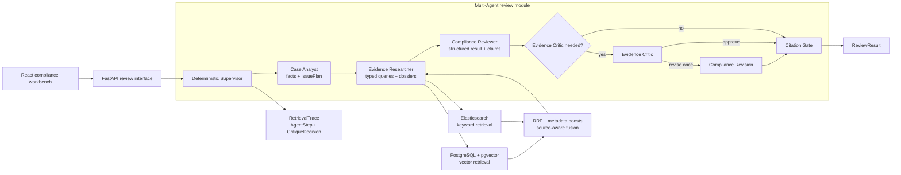
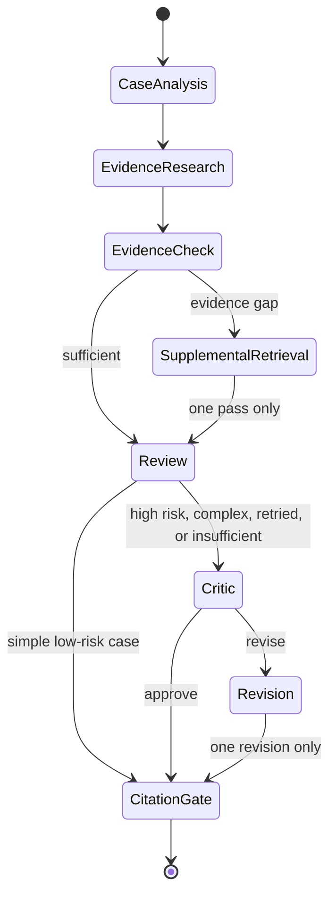

# LawAgent Architecture

LawAgent keeps one deep external interface — a review case in, a governed review result out — while the implementation coordinates deterministic control flow, LLM-owned roles, and real retrieval adapters.

## System architecture

## Execution and termination

The Supervisor owns ordering and termination. LLM nodes cannot create an unbounded loop. Claim support IDs are filtered against the current evidence set and `can_cite_clause`; guidance and standards remain visible as implementation evidence but cannot be presented as clause-level legal authority.

## Module seams

| Module | Interface | Implementation hidden behind it |
|---|---|---|
| Review workflow | `ReviewCase -> ReviewResult` | Agent ordering, retry, one-pass revision, persistence |
| Retrieval | typed queries -> `RetrievalHit[]` | ES/pgvector adapters, RRF, boosts, source diversity, neighbors |
| Case Analyst | queries -> `IssuePlan` | deterministic issue grouping; no extra LLM call |
| Evidence Researcher | plan + hits -> dossiers | issue-level evidence mapping and gap detection |
| Evidence Critic | result + dossiers -> decision | Flash LLM with strict schema and bounded retry |
| Citation governance | claims + evidence -> governed claims | anti-hallucination whitelist and clause eligibility |

LangGraph is intentionally not a runtime dependency. The current workflow does not require checkpoint recovery, human interruption, or complex nested graphs; the deterministic Supervisor provides a smaller interface and keeps behavior directly testable.
