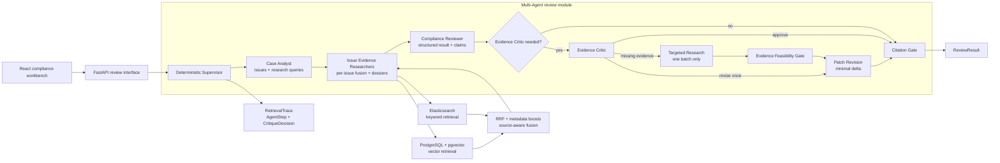

# LawAgent Architecture

LawAgent keeps one deep external interface — a review case in, a governed review result out — while the implementation coordinates deterministic control flow, LLM-owned roles, and real retrieval adapters.

## System architecture

## Execution and termination

```mermaid
stateDiagram-v2
    [*] --> CaseAnalysis
    CaseAnalysis --> EvidenceResearch
    EvidenceResearch --> EvidenceCheck
    EvidenceCheck --> SupplementalRetrieval: evidence gap
    EvidenceCheck --> Review: sufficient
    SupplementalRetrieval --> Review: one pass only
    Review --> Critic: high risk, retried, or insufficient
    Review --> CitationGate: simple low-risk case
    Critic --> CitationGate: approve
    Critic --> TargetedRetrieval: evidence gap
    TargetedRetrieval --> FeasibilityGate: one batch only
    FeasibilityGate --> Revision: relevant citable evidence exists
    FeasibilityGate --> Revision: unavailable request becomes evidence gap
    Critic --> Revision: revise without retrieval
    Revision --> CitationGate: one revision only
    Revision --> CitationGate: validation fails; keep original
    CitationGate --> [*]
```

The Supervisor owns ordering and termination. LLM nodes cannot create an unbounded loop. Claim support IDs are filtered against the current evidence set and `can_cite_clause`; guidance and standards remain visible as implementation evidence but cannot be presented as clause-level legal authority.

## Module seams

| Module | Interface | Implementation hidden behind it |
|---|---|---|
| Review workflow | `ReviewCase -> ReviewResult` | Agent ordering, retry, one-pass revision, persistence |
| Retrieval | typed queries -> `RetrievalHit[]` | ES/pgvector adapters, RRF, boosts, source diversity, neighbors |
| Case Analyst | case + frozen queries -> `CaseAnalysis` | Flash-generated issues and bounded issue-specific queries |
| Evidence Researcher | plan + per-query hits -> dossiers | per-issue fusion, three global anchors, issue/source allocation |
| Evidence Critic | result + dossiers -> typed actions | remove, narrow, supported add, evidence gap, boundary, or abstain |
| Revision gate | actions + targeted hits -> feasible actions | rejects irrelevant citable hits and downgrades impossible additions to gaps |
| Compliance Revision | validated result + feasible actions -> patch | minimal delta; cannot introduce unavailable titled legal sources |
| Result resilience | validated result or deterministic fallback | initial generation fallback; failed revision preserves original |
| Citation governance | claims + evidence -> governed claims | anti-hallucination whitelist and clause eligibility |

For `insufficient_evidence`, revision is deterministic: claims remain empty and evidence gaps are appended without another LLM call. LangGraph is intentionally not a runtime dependency. The current workflow does not require checkpoint recovery, human interruption, or complex nested graphs; the deterministic Supervisor provides a smaller interface and keeps behavior directly testable.
